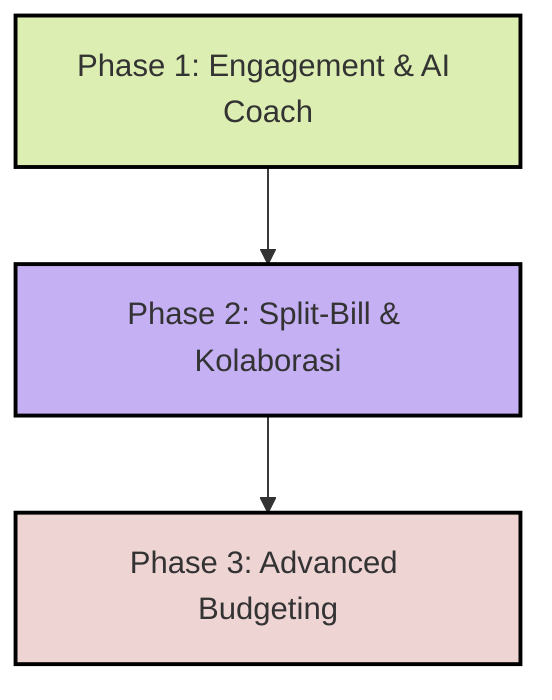

# ROADMAP_v2.md

Dokumen ini berisi peta jalan (*roadmap*) pengembangan untuk **Fimo V2** (Tahap Awal: Full Gratisan & Early Access). Dokumen ini merinci rencana kerja mingguan, dependensi fitur, perubahan skema database, serta mekanisme mitigasi biaya API AI. Fitur integrasi perbankan otomatis dan monetisasi ditunda ke fase rilis premium berikutnya (Pasca-V2).

---

## Gambaran Umum Fase Rilis Fimo V2



---

## PHASE 1 — Engagement & AI Coach (Target: Minggu 1–3)

Tujuan: Mengintegrasikan AI Coach harian/mingguan yang hemat token, menambahkan gamifikasi streak pencatatan, dan fitur Travel Wallet.

### Minggu 1 — Gamifikasi & Daily Advisor Rules 🛠️
* **Database Updates:**
  - Tambah kolom `record_streak` (integer, default: 0) dan `last_recorded_at` (timestamp with time zone) di tabel `profiles`.
  - Buat trigger database `update_user_streak()` setiap kali baris baru masuk ke tabel `transactions`.
* **Fitur & UI/UX:**
  - Desain ikon streak api (`StreakIndicator`) monokrom minimalis di pojok kanan atas top navbar.
  - Implementasi *Rule-Based Daily Advisory* (Edge Function checking budget thresholds). Jika sisa budget <20%, generate notifikasi *warning* statis tanpa memicu API AI.
  - CRUD Travel/Event Wallet: Tambahkan kolom `is_event_wallet` (boolean, default: false) dan `event_metadata` (jsonb) ke tabel `wallets`.

**Deliverable:** Pengguna memiliki indikator streak pencatatan aktif dan sistem Fimo bisa mendeteksi pembuatan Travel Wallet.

---

### Minggu 2 — AI Coach & Caching Engine (Gemini 3.1 Flash-Lite) 🛠️
* **Database Updates:**
  - [NEW] Tabel `ai_insights` (id, user_id, type ['daily', 'weekly'], content text, created_at, expire_at).
* **Fitur & Backend:**
  - Integrasi API **Gemini 3.1 Flash-Lite** (untuk tips harian cepat/murah) dan **Gemini 3.5 Pro** (untuk rangkuman tren mingguan).
  - Implementasi **Caching Layer** di Server Action: periksa `ai_insights` sebelum memanggil API Gemini. Jika `expire_at > NOW()`, gunakan data dari database.
  - Setup cron job harian (08:00 WIB) untuk menganalisis anomali transaksi hari sebelumnya dan men-generate tips harian ter-caching.
* **UI/UX:**
  - Tampilkan modul `Fimo AI Coach` di dashboard menggunakan card pastel lilac (`#c5b0f4`) dengan tipe tulisan `figmaMono` untuk menyajikan data statistik.

**Deliverable:** Dashboard menampilkan saran finansial personal harian dan mingguan secara responsif tanpa pemborosan token API.

---

### Minggu 3 — Laporan Travel & Event Wallet 🛠️
* **Fitur & Analisis:**
  - Update halaman Laporan (`/dashboard/reports`) agar mengecualikan transaksi dari wallet yang ditandai sebagai `is_event_wallet = true` dari pengeluaran bulanan utama.
  - Buat tab khusus "Laporan Acara/Travel" yang menampilkan ringkasan pengeluaran spesifik event tersebut berdasarkan rentang tanggal `event_metadata`.
* **UI/UX:**
  - Tampilkan daftar wallet dengan ikon koper/kalender minimalis bersudut tumpul besar (`rounded.lg`).

**Deliverable:** Pengguna bisa mengelompokkan pengeluaran liburan/acara secara terpisah dari keuangan bulanan.

---

## PHASE 2 — Split-Bill & Kolaborasi (Target: Minggu 4–6)

Tujuan: Menghadirkan fitur pembagian tagihan kelompok (Split-Bill) yang terintegrasi dengan pemindaian struk AI.

### Minggu 4 — Skema Database Grup & RLS Policies 🛠️
* **Database Updates ([NEW] Tables):**
  - **`groups`** (id, name, created_by, created_at)
  - **`group_members`** (group_id, user_id, joined_at)
  - **`group_expenses`** (id, group_id, paid_by_user_id, amount, description, split_details jsonb, created_at)
  - Pasang **RLS Policy** ketat: hanya user yang terdaftar di `group_members` yang dapat membaca atau menulis data grup bersangkutan.
* **UI/UX:**
  - Halaman Manajemen Grup (`/dashboard/groups`) menggunakan grid monokrom tebal dan list anggota kelompok dengan tombol pil (*pill-shaped*).

**Deliverable:** Pengguna bisa membuat grup dan mengundang anggota lain (berdasarkan e-mail profile Supabase).

---

### Minggu 5 — Integrasi Scan Struk & Alur Split-Bill 🛠️
* **Fitur & Backend:**
  - Hubungkan *Receipt Scanner AI* (menggunakan **Gemini 3.5 Flash**) dengan tombol opsi **"Bagi Tagihan"** pada modal konfirmasi struk.
  - Logika pembagian nominal: Dukungan pembagian merata (split-equal) maupun kustom persentase/nominal.
  - Pengiriman notifikasi tagihan secara realtime ke seluruh anggota grup via Supabase Realtime & Firebase FCM.

**Deliverable:** Pengguna bisa memindai struk makan bersama dan membagi tagihan tersebut ke teman-temannya di dalam grup.

---

### Minggu 6 — Buku Besar Utang-Piutang (Ledger & Settle Up) 🛠️
* **Fitur & Backend:**
  - Algoritma penyederhanaan utang kelompok (*simplified debt calculation*): menghitung siapa harus membayar siapa secara efisien.
  - Tombol **"Settle Up"** (Konfirmasi Pembayaran) untuk mencatat transfer penyelesaian utang antar-anggota grup.
* **UI/UX:**
  - Tampilan visual neraca grup menggunakan panel pastel pink (`#efd4d4`) untuk utang Anda, dan pastel lime (`#dceeb1`) untuk piutang Anda.

**Deliverable:** Pengguna dapat melihat daftar utang-piutang kelompok dan menandai tagihan sebagai lunas.

---

## PHASE 3 — Advanced Budgeting (Target: Minggu 7)

Tujuan: Penerapan envelope budgeting virtual untuk mengunci anggaran khusus.

### Minggu 7 — Smart Envelope Saving Goals 🛠️
* **Database Updates:**
  - [NEW] Tabel `saving_envelopes` (id, user_id, name, target_amount, current_amount, color_hex, is_locked, created_at).
* **Fitur & Logic:**
  - Fitur alokasi saldo virtual: memotong saldo yang dapat dibelanjakan (*spendable balance*) pada dashboard utama dan menguncinya ke dalam amplop tabungan virtual.
  - Proteksi transaksi: Transaksi harian tidak bisa menggunakan saldo yang sudah dialokasikan di dalam amplop aktif.
* **UI/UX:**
  - Tampilkan amplop tabungan menggunakan kartu pastel coral (`#f3c9b6`) dengan bar progres pencapaian tabungan yang dinamis.
* **Audit & Final Cleanup V2:**
  - Jalankan pengujian kebocoran memori di Next.js, audit RLS pada tabel grup dan member grup baru.
  - Setup mekanisme penghapusan data otomatis (*GDPR-ready*) jika grup atau akun dibubarkan oleh pengguna.

**Deliverable:** Pengguna bisa mengunci dana anggaran khusus (seperti "Dana Darurat") secara terpisah dari saldo belanja harian. Fimo V2 siap dideploy secara full gratisan (Early Access).

---

## Rincian Kebutuhan Model AI & Mitigasi Biaya

| Fitur | Model AI Utama | Model AI Fallback | Batasan Token / Limit Akses | Metode Caching |
| :--- | :--- | :--- | :--- | :--- |
| **Scan Struk** | **Gemini 3.5 Flash** | Claude 3.5 Sonnet | Max 5 kali scan / user / hari | Tidak ada (data dinamis) |
| **AI Coach Harian** | **Gemini 3.1 Flash-Lite** | Tidak ada | Max 1 kali running / hari | Disimpan di tabel `ai_insights` (expire: 24 jam) |
| **AI Coach Mingguan**| **Gemini 3.5 Pro** | Claude 3.5 Sonnet | Run otomatis setiap Senin pagi | Disimpan di tabel `ai_insights` (expire: 7 hari) |

---

## Dependensi Pengurutan Fitur V2

```
                       ┌──► Travel Wallet ──┐
                       │                    │
Profiles (Streak) ─────┼──► AI Coach (Lite) ┼──► Split-Bill ──► Envelopes (Week 7)
                       │                    │
                       └──► ai_insights ────┘
```

---

## 6. Berkas & Source Code yang Terdampak (Impacted Files)

Berikut adalah daftar berkas yang akan dibuat [NEW] atau dimodifikasi [MODIFY] selama proses implementasi Fimo V2:

### A. Database & Migrasi (Supabase)
* **[NEW]** `supabase/migrations/20260611000000_v2_gamification_streak.sql` -> Migrasi kolom streak pencatatan di profiles.
* **[NEW]** `supabase/migrations/20260611000001_v2_ai_insights.sql` -> Pembuatan tabel `ai_insights` untuk caching tips.
* **[NEW]** `supabase/migrations/20260611000002_v2_travel_wallet.sql` -> Penyesuaian tabel `wallets` untuk field event.
* **[NEW]** `supabase/migrations/20260611000003_v2_split_bill.sql` -> Tabel `groups`, `group_members`, `group_expenses`, dan kebijakan RLS.
* **[NEW]** `supabase/migrations/20260611000004_v2_saving_envelopes.sql` -> Tabel `saving_envelopes`.

### B. Server Actions & Backend (`src/actions/`)
* **[NEW]** [ai-coach.ts](file:///d:/Data/My%20SSD/Documents/My-Project/fimo/finance_memo/src/actions/ai-coach.ts) -> Panggilan API Gemini 3.1/3.5 dengan mekanisme caching database.
* **[NEW]** [groups.ts](file:///d:/Data/My%20SSD/Documents/My-Project/fimo/finance_memo/src/actions/groups.ts) -> Operasi database untuk grup, pembagian tagihan, dan pembayaran (settle).
* **[NEW]** [envelopes.ts](file:///d:/Data/My%20SSD/Documents/My-Project/fimo/finance_memo/src/actions/envelopes.ts) -> Alokasi dan penguncian saldo ke dalam amplop tabungan.
* **[MODIFY]** [transactions.ts](file:///d:/Data/My%20SSD/Documents/My-Project/fimo/finance_memo/src/actions/transactions.ts) -> Update logika untuk memperhitungkan status streak saat input transaksi baru.
* **[MODIFY]** [reports.ts](file:///d:/Data/My%20SSD/Documents/My-Project/fimo/finance_memo/src/actions/reports.ts) -> Penyaringan data transaksi khusus agar mengecualikan `event_wallet`.

### C. Komponen UI (`src/components/`)
* **[NEW]** [AICoachCard.tsx](file:///d:/Data/My%20SSD/Documents/My-Project/fimo/finance_memo/src/components/dashboard/AICoachCard.tsx) -> Card panel kuning/lilac pastel di dashboard.
* **[NEW]** [StreakIndicator.tsx](file:///d:/Data/My%20SSD/Documents/My-Project/fimo/finance_memo/src/components/layout/StreakIndicator.tsx) -> Ikon api streak di header navbar.
* **[NEW]** [GroupForm.tsx](file:///d:/Data/My%20SSD/Documents/My-Project/fimo/finance_memo/src/components/groups/GroupForm.tsx) -> Modal membuat grup kolaboratif baru.
* **[NEW]** [EnvelopeProgress.tsx](file:///d:/Data/My%20SSD/Documents/My-Project/fimo/finance_memo/src/components/envelopes/EnvelopeProgress.tsx) -> Bar progres pencapaian saving goal.
* **[MODIFY]** [Navbar.tsx](file:///d:/Data/My%20SSD/Documents/My-Project/fimo/finance_memo/src/components/layout/Navbar.tsx) -> Menyisipkan `StreakIndicator` di sebelah Bell notifikasi.
* **[MODIFY]** [ReceiptScanner.tsx](file:///d:/Data/My%20SSD/Documents/My-Project/fimo/finance_memo/src/components/transactions/ReceiptScanner.tsx) -> Penambahan dropdown opsi "Split-Bill" pasca-pemindaian struk selesai.

### D. Halaman Router (`src/app/`)
* **[NEW]** [dashboard/groups/page.tsx](file:///d:/Data/My%20SSD/Documents/My-Project/fimo/finance_memo/src/app/dashboard/groups/page.tsx) -> Daftar grup user.
* **[NEW]** [dashboard/groups/[id]/page.tsx](file:///d:/Data/My%20SSD/Documents/My-Project/fimo/finance_memo/src/app/dashboard/groups/[id]/page.tsx) -> Detail transaksi grup dan neraca utang-piutang.
* **[NEW]** [dashboard/envelopes/page.tsx](file:///d:/Data/My%20SSD/Documents/My-Project/fimo/finance_memo/src/app/dashboard/envelopes/page.tsx) -> Halaman manajemen amplop tabungan.
* **[MODIFY]** [dashboard/dashboard/page.tsx](file:///d:/Data/My%20SSD/Documents/My-Project/fimo/finance_memo/src/app/dashboard/dashboard/page.tsx) -> Penempatan card `Fimo AI Coach` dan penyusutan saldo spendable karena amplop tabungan.

---

## 7. Arsitektur & Alur Data Baru (V2 Architecture Flows)

### A. Alur Caching AI Coach Harian & Mingguan
```
[User Dashboard]
      │ (request insights)
      ▼
[Server Action: getAICoachInsight()]
      │
      ├──► [Check DB: tabel ai_insights]
      │          │
      │          ├──► (Ada & Belum Expired) ──► Kembalikan Data Cache ke Dashboard
      │          │
      │          └──► (Tidak Ada / Expired)
      │                     │
      │                     ▼
      │              [Panggil Gemini API]
      │                     │ (Gemini 3.1 Flash-Lite / 3.5 Pro)
      │                     ▼
      │              [Simpan/Cache ke DB]
      │                     │
      │                     ▼
      └─────────────────────┴──► Kembalikan Hasil Generasi Baru
```

### B. Alur Alokasi Virtual Envelope Budgeting
```
[Wallet Saldo Utama] ◄─── (Pindahkan Dana) ───► [Virtual Saving Envelope]
      │                                                 │
      ▼                                                 ▼
[Spendable Balance Card]                         [Locked Savings Goal]
(Dikurangi dana teralokasi)                      (Di-render dengan bar progres)
      │
      ▼
(Dipakai belanja transaksi harian)
```

---

## Definition of Done (DoD) Fimo V2

Task dinyatakan selesai (*Done*) jika memenuhi kriteria berikut:
1. **Zero TypeScript Errors:** Kode terbebas dari kesalahan tipe di environment build.
2. **Strict RLS:** Kebijakan RLS memblokir akses pengguna non-grup ke tabel `groups` dan `group_expenses`.
3. **Optimasi Biaya Token:** AI Coach tidak memicu pemanggilan API jika tip harian sudah tercatat di database dalam kurun waktu 24 jam terakhir.
4. **Desain Editorial Terjaga:** Memenuhi grid monokromatik border tipis tebal dan panel blok pastel sesuai pedoman [DESIGN.md](file:///.agents/DESIGN.md).
5. **Responsive layouts:** Tampilan ramah dan proporsional untuk resolusi mobile (375px) hingga desktop (1280px).

---

## BACKLOG MASA DEPAN — Rencana Premium & Bank Sync (Pasca V2)

Berikut adalah fitur yang ditunda demi menjaga rilis Fimo V2 100% gratis dan berfokus pada Early Access:

### A. Minggu 8 (Backlog) — Integrasi Open Finance API Bank (Brick/Brankas)
* Buat API Route `/api/webhooks/bank-sync` untuk menerima data mutasi transaksi.
* Menyimpan token API agregator bank terenkripsi di Supabase.
* Modifikasi UI wallet untuk tombol hubung rekening bank eksternal.

### B. Minggu 9 (Backlog) — Monetisasi Premium & Gatekeeper
* Integrasi payment gateway (Stripe/Xendit) untuk fitur berlangganan Fimo Premium.
* Pembuatan filter middleware untuk membatasi akses impor otomatis bank bagi user gratis.

### C. Alur Data Integrasi Bank Otomatis (Backlog)
```
[Bank Mutasi User] ──► [Agregator Open Finance] ──► [Webhook Fimo API] ──► [transactions Table]
```
