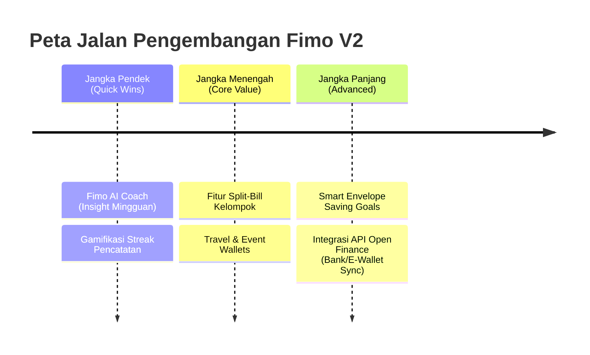

# PRODUCT_BRAINSTORM.md

Dokumen ini berisi rangkuman hasil *brainstorming*, analisis komparatif dengan aplikasi pencatatan keuangan populer, serta rekomendasi pengembangan fitur baru untuk **Fimo (Finance Memo)**. Ide-ide di bawah ini dirancang agar selaras dengan arsitektur teknologi Fimo (Next.js 14, Supabase DB & Edge Functions, Claude/Gemini Vision AI, FCM) serta filosofi desain *"paste-editorial"* yang minimalis dan estetis.

---

## 1. Pemetaan Kompetitor & Komparasi Fitur

Untuk memahami posisi Fimo di pasar, berikut adalah komparasi mendalam dengan 5 aplikasi pencatatan keuangan pribadi terpopuler:

| Fitur / Aspek | **Fimo (Current)** | **YNAB (You Need A Budget)** | **Wallet (BudgetBakers)** | **Money Lover** | **Splitwise** | **Copilot Money** |
| :--- | :--- | :--- | :--- | :--- | :--- | :--- |
| **Metodologi Utama** | Pencatatan & Budgeting Kategori | *Zero-Based Budgeting* (ZBB) - Kas berkategori | Pelacakan Transaksi & Sinkronisasi Bank | Pencatatan Harian & Perencanaan Sederhana | Pembagian Pengeluaran Kelompok (*Split*) | AI-first Tracking & Investment Monitoring |
| **Gaya Desain & Estetika** | *Paste-editorial* (Monokrom + Pastel Block) | Fungsional, padat, korporat-bersih | Modern, warna-warni, padat informasi | Gamifikasi, ilustratif, ramah pengguna | Sederhana, fokus pada list & angka | Ultra-premium, dark mode, animasi mulus |
| **Integrasi AI** | Scan Struk (Gemini/Claude Vision) | Tidak ada (sangat manual) | Deteksi kategori dasar non-LLM | Deteksi kategori otomatis | Tidak ada | Kategori pintar berbasis ML, pola cashflow |
| **Kolaborasi & Sosial** | Single-user | Multi-user (YNAB Together) | *Shared Wallets* (Premium) | *Shared Wallets* (Premium) | *Group Bills* & Penyelesaian Utang | Tidak ada |
| **Otomatisasi** | Recurring template + Cron harian | Recurring bills | Sinkronisasi API Bank otomatis | Recurring bills | Pengingat tagihan berulang | Sinkronisasi otomatis + Prediksi tagihan |
| **Kemudahan Penggunaan** | Sedang-Tinggi (AI mempercepat input) | Sangat Rendah (Butuh belajar metode ZBB) | Sedang (Banyak menu & integrasi) | Tinggi (Sangat kasual & intuitif) | Tinggi (Fokus pada satu fungsi) | Tinggi (Otomatisasi maksimal) |

---

## 2. Analisis SWOT Fimo

Berdasarkan arsitektur saat ini ([ARCHITECTURE.md](file:///.agents/ARCHITECTURE.md)) dan fitur yang telah selesai dibangun ([FEATURES.md](file:///.agents/FEATURES.md)), berikut adalah analisis SWOT untuk Fimo:

### **Strengths (Kekuatan)**
1. **AI-Native Scanner Terintegrasi:** Dukungan langsung untuk pemrosesan struk menggunakan Vision AI (Gemini/Claude) yang membuat input transaksi jauh lebih cepat dibanding entri manual biasa.
2. **Desain Editorial Premium:** Estetika monokrom dengan aksen blok pastel yang mencolok membuat Fimo sangat menonjol di antara aplikasi keuangan lain yang cenderung monoton atau terlalu mirip spreadsheet.
3. **Arsitektur Serverless & Realtime:** Supabase + Edge Functions memungkinkan sistem notifikasi instan (FCM & In-app) serta pemrosesan recurring otomatis yang andal tanpa overhead server yang mahal.

### **Weaknesses (Kelemahan)**
1. **Pencatatan Mandiri Tanpa Integrasi Bank:** Pengguna harus menginput transaksi secara manual atau via struk (tidak ada sinkronisasi otomatis dengan bank lokal Indonesia seperti BCA/Mandiri/GoPay).
2. **Keterbatasan Fitur Kolaboratif:** Belum mendukung pembagian tagihan kelompok atau dompet bersama (misalnya untuk pasangan atau keluarga).
3. **Analisis Tren Masih Statis:** Laporan bulanan masih berupa chart pasif, belum ada analisis AI yang memberikan saran proaktif secara otomatis ke pengguna.

### **Opportunities (Peluang)**
1. **AI Financial Advisor Lokalisasi:** Menyediakan pelatih finansial AI yang mengerti gaya hidup lokal (misal: analisis jajan boba/kopi susu, tips menghemat uang di akhir bulan).
2. **Fitur "Split-Bill" Minimalis:** Memasukkan fitur ala Splitwise langsung ke dalam alur transaksi Fimo, memudahkan pencatatan pengeluaran bersama saat nongkrong.
3. **Travel/Event Wallet:** Dompet sementara untuk liburan atau acara tertentu, memisahkan pengeluaran khusus ini dari budget harian/bulanan biasa.

### **Threats (Ancaman)**
1. **Biaya Token API AI:** Penggunaan Claude/Gemini Vision untuk scan struk dan insight AI memiliki biaya per panggilan. Jika pengguna melakukan spam, biaya API bisa membengkak.
2. **Persaingan Aplikasi Bank:** Aplikasi bank digital saat ini (seperti Jenius, Jago, Blu) sudah memiliki fitur pencatatan dan kantong budget bawaan.

---

## 3. Rekomendasi Fitur Baru (Fimo Feature Expansion)

Berikut adalah 5 usulan fitur baru yang dirancang secara spesifik untuk memanfaatkan teknologi Supabase, Next.js, dan AI di Fimo:

#### Fitur A: "Fimo AI Coach" (Proactive Financial Insights) — Opsi Harian & Mingguan
* **Konsep:** LLM (Gemini/Claude) menganalisis pola transaksi pengguna dan memberikan insight proaktif secara personal. Fitur ini dirancang memiliki dua frekuensi:
  * **Harian (Daily Micro-Advisory):** Bukan ringkasan penuh, melainkan notifikasi pemicu aksi yang cepat (misal: *"Kamu sudah pakai 90% budget makan hari ini. Makan malam di rumah saja ya?"* atau tips harian berdasarkan pengeluaran kemarin).
  * **Mingguan (Weekly Financial Review):** Analisis tren mendalam (misal: *"Analisis 7 hari terakhir menunjukkan kenaikan jajan kopi 15%. Jika ini ditekan, kamu bisa mencapai target tabungan liburan 2 minggu lebih cepat."*).
* **Cara Kerja:**
  1. **Edge Function Harian (08:00 WIB):** Cek anomali transaksi hari sebelumnya atau status budget terdekat. Jika ada kategori yang mendekati batas (>80%), buat tip singkat.
  2. **Edge Function Mingguan (Senin pagi):** Mengumpulkan data transaksi 7 hari terakhir dan membandingkannya dengan minggu sebelumnya.
  3. **Generasi Teks:** Kirim ringkasan statistik (tanpa informasi sensitif seperti nama bank atau detail identitas) ke LLM untuk memformat teks dengan gaya personal, jenaka, dan suportif.
  4. **Notifikasi:** Dikirimkan via FCM dan disimpan di tabel `notifications` untuk tab in-app.
* **Kesesuaian Desain:** Tampilkan di Dashboard utama sebagai card pastel kuning/cream bergaya memo tempel (*sticky notes*) dengan font monospace `figmaMono` untuk data angka, dan `figmaSans` untuk pesannya.

### Fitur B: "Fimo Split-Bill & Group Debts" (Adaptasi Splitwise)
* **Konsep:** Fitur membagi tagihan dengan teman langsung dari riwayat transaksi atau scan struk AI.
* **Cara Kerja di Database:**
  * Tambahkan tabel baru `groups` (id, name, created_by).
  * Tambahkan tabel `group_members` (group_id, user_id).
  * Tambahkan tabel `group_expenses` (id, group_id, paid_by_user_id, amount, description, split_details jsonb).
  * RLS policy memastikan hanya anggota grup yang bisa membaca dan menulis data ini.
* **Alur Penggunaan:**
  1. User memindai struk makan malam kelompok dengan AI.
  2. Setelah data struk terbaca, user memilih opsi **"Bagi Tagihan"**.
  3. User memilih anggota grup (atau menginput nama secara manual jika teman belum memiliki akun Fimo).
  4. Fimo menghitung pembagian secara otomatis (sama rata atau kustom) dan mengirimkan notifikasi penagihan / ringkasan utang ke anggota grup.
* **Kesesuaian Desain:** Desain tabel pembagian dengan garis *hairline* tebal monokrom, dipadukan dengan tombol pil (*pill-shaped buttons*) khas Fimo.

### Fitur C: "Smart Envelope Saving Goals" (Adaptasi YNAB)
* **Konsep:** Mengalokasikan uang secara virtual dari wallet utama ke dalam "Amplop Tabungan" (Saving Envelopes) tertentu untuk mencegah uang tersebut tidak sengaja terbelanjakan.
* **Cara Kerja:**
  * Pengguna membuat amplop tabungan (contoh: "Tiket Konser", "Dana Darurat").
  * Pengguna memindahkan saldo dari wallet utama (misal: Wallet Cash) ke amplop ini.
  * Uang di dalam amplop dikunci dari saldo aktif yang ditampilkan di dashboard utama, sehingga pengguna merasa uang tersebut "sudah terpakai" untuk masa depan.
* **Kesesuaian Desain:** Menggunakan blok warna pastel pink (`#efd4d4`) atau lilac (`#c5b0f4`) untuk merepresentasikan setiap amplop di dashboard dengan ilustrasi garis minimalis.

### Fitur D: "Travel & Event Wallet" (Adaptasi Money Lover)
* **Konsep:** Dompet sementara yang memiliki durasi aktif khusus dan kategori tersendiri untuk mengelompokkan pengeluaran proyek, liburan, atau pernikahan tanpa mencampurnya dengan pengeluaran bulanan rutin.
* **Cara Kerja:**
  * Di tabel `wallets`, tambahkan kolom `is_event_wallet` (boolean) dan `event_metadata` (jsonb berisi tanggal mulai dan selesai).
  * Ketika wallet ini aktif, laporan bulanan utama akan mengecualikan transaksi di dompet ini, dan pengguna mendapatkan tab laporan khusus untuk event tersebut.
* **Kesesuaian Desain:** Ditampilkan dengan desain kartu wallet yang memiliki ikon "Luggage" atau "Calendar" minimalis dengan sudut tumpul besar (`rounded.lg: 24px`).

### Fitur E: Gamifikasi "Financial Fitness Streak"
* **Konsep:** Meningkatkan retensi pengguna dengan memberikan apresiasi/penghargaan atas kedisiplinan mencatat keuangan secara berturut-turut.
* **Cara Kerja:**
  * Tambahkan kolom `record_streak` (integer) dan `last_recorded_at` (timestamp) pada tabel `profiles`.
  * Setiap kali user menambahkan transaksi atau memindai struk, sistem memeriksa apakah ini hari berikutnya dari pengisian terakhir. Jika ya, streak bertambah.
  * Notifikasi harian ramah dikirimkan jika user belum mencatat pengeluaran sebelum jam 9 malam.
* **Kesesuaian Desain:** Tampilkan ikon streak api monokrom sederhana di bagian pojok kanan atas top navbar, berdampingan dengan ikon notifikasi bell.

---

## 3.5. Strategi Mitigasi Ancaman Biaya Token API AI

Penggunaan model Vision AI (untuk struk) dan Text Gen AI (untuk coach) bisa menimbulkan pembengkakan biaya jika tidak dikelola dengan hati-hati. Berikut adalah arsitektur pencegahan kebocoran biaya (*cost-mitigation strategies*) yang kami rancang untuk Fimo:

1. **Routing Model AI Hybrid (Cerdas & Murah):**
   * **Pencatatan & Scan Struk:** Gunakan model yang lebih hemat, cepat, dan terbaru seperti **Gemini 3.5 Flash** atau **Gemini 3.1 Flash-Lite** (atau **Llama-3-8b-Groq** via Groq API yang memiliki tier gratis sangat besar / biaya token super murah) untuk ekstraksi teks OCR terstruktur. Gunakan model premium (seperti **Gemini 3.5 Pro** atau Claude 3.5 Sonnet) *hanya* jika tingkat keyakinan (*confidence level*) ekstraksi di bawah 70% atau terdeteksi kegagalan parsing.
   * **AI Coach Harian:** Gunakan model hemat energi dan sangat cepat seperti **Gemini 3.1 Flash-Lite** untuk tip harian karena hanya memerlukan pemahaman konteks yang kecil dan berbiaya sangat rendah.

2. **Penyaringan Berbasis Aturan (Rule-Based Filtering):**
   * Jangan panggil API AI untuk logika matematika atau kalkulasi budget biasa. Gunakan kode Javascript/Postgres untuk mendeteksi apakah budget telah melewati 80%.
   * Panggil LLM *hanya* ketika kondisi tersebut terpenuhi untuk mengubah data mentah tersebut menjadi kalimat motivasi/insight yang natural dan humanis. Jika tidak ada anomali atau kejadian khusus hari itu, kirimkan template tips hemat statis (tanpa memicu API AI).

3. **Caching & Database Storage (Tabel `ai_insights`):**
   * Simpan hasil generasi AI Coach di tabel database `ai_insights` dengan kolom `expire_at`.
   * Jika pengguna membuka aplikasi 10 kali dalam sehari, dashboard akan mengambil teks yang sudah di-generate sebelumnya dari database, bukan memanggil API AI berulang kali.

4. **Rate Limiting Ketat di Level Server Actions:**
   * Batasi panggilan API `/api/ai/scan-receipt` maksimal **5 kali per user per hari** (atau 10 kali per jam) menggunakan pencatatan log di Supabase (misal, menghitung row struk non-proses hari ini sebelum meneruskan ke API AI).
   * Batasi AI Coach harian maksimal **1 kali generasi per hari per user**.

5. **Pembatasan Token Output (Strict Output Limit):**
   * Set parameter `max_tokens` serendah mungkin (misal: 100 token untuk tip harian, 250 token untuk review mingguan).
   * Gunakan format JSON terstruktur di prompt sistem agar AI langsung menghasilkan teks siap pakai tanpa basa-basi pembuka/penutup yang membuang token.

---

## 3.6. Konsep Integrasi API Bank (Open Finance)

Integrasi bank otomatis bertujuan mempermudah pengguna agar tidak perlu lagi melakukan pencatatan manual. Berikut penjelasan mengenai konsep, biaya, dan keamanannya:

### A. Bagaimana Konsep Hubungannya?
Fimo tidak langsung terhubung dengan infrastruktur bank internal secara mandiri karena bank-bank di Indonesia memiliki protokol keamanan yang sangat ketat dan tertutup untuk developer individu. Sebagai gantinya, Fimo menggunakan **Agregator Open Finance / Open Banking** pihak ketiga seperti **Brick (onebrick.co)**, **Brankas**, atau **Finantier**.
1. Pengguna membuka widget agregator di aplikasi Fimo.
2. Pengguna memilih bank mereka (misal: BCA, Mandiri, GoPay, OVO) dan memasukkan kredensial (username/password e-banking).
3. Agregator Open Finance membuat koneksi aman dan melakukan *scraping* / membaca mutasi transaksi secara otomatis.
4. Agregator mengirim data mutasi baru ke webhook Fimo (`/api/webhooks/bank-sync`).
5. Server Action Fimo memasukkan data tersebut ke tabel `transactions` dan meng-update saldo wallet terkait.

### B. Apakah Ini Gratis?
* **TIDAK GRATIS.** Agregator Open Finance mengenakan biaya berlangganan bulanan per akun bank yang aktif terhubung (misalnya berkisar antara **Rp5.000 - Rp15.000 per koneksi per bulan**), atau biaya per penarikan data mutasi.
* **Solusi Model Bisnis Fimo:** Fitur ini tidak bisa digratiskan untuk semua user. Fimo harus menjadikannya sebagai **Fitur Premium (SaaS Paid Tier)**. Biaya langganan bulanan dari user premium akan digunakan untuk menutupi biaya tagihan API dari agregator Open Finance ini.

### C. Apakah Aman bagi Pengguna?
1. **Akses Hanya-Baca (Read-Only Access):** API yang disediakan oleh agregator *hanya* membaca riwayat mutasi rekening. Fimo maupun agregator **tidak memiliki akses untuk melakukan transfer uang, mengubah saldo, atau memotorisasi transaksi finansial apa pun**. Dana pengguna tetap 100% aman di bank.
2. **Kredensial Tidak Disimpan di Fimo:** Kredensial login bank pengguna (seperti PIN atau password) diproses langsung secara terenkripsi oleh agregator yang telah tersertifikasi keamanan standar internasional (seperti PCI-DSS Level 1) dan diawasi oleh **Bank Indonesia (BI) / Otoritas Jasa Keuangan (OJK)** di bawah regulasi SNAP (Standar Nasional Open API Pembayaran). Fimo hanya menyimpan *secure token* hasil otentikasi tersebut.
3. **Pemberitahuan Otomatis:** Setiap kali koneksi API bank mengakses data mutasi, bank biasanya mengirimkan notifikasi login/akses data ke email pengguna sebagai lapisan transparansi tambahan.

---

## 4. Penyelarasan Desain (UI/UX) sesuai DESIGN.md

Untuk mempertahankan identitas visual Fimo yang kuat, implementasi fitur-fitur di atas harus mematuhi aturan berikut:

1. **Monochrome Grid Structure:**
   Semua container baru harus menggunakan grid hitam-putih yang bersih, dengan pembatas garis tipis abu-abu (`border-hairline` atau `#e6e6e6`). Hindari bayangan (*drop shadow*) yang terlalu halus dan blur; gunakan bayangan tegas bergaya retro-neo-brutalist (jika ada) atau tanpa bayangan sama sekali dengan penekanan pada ketebalan border (`border-2 border-black`).

2. **Pastel Block as Information Layer:**
   Pastel block digunakan untuk menunjukkan status atau membedakan kategori informasi:
   * **Lime (`#dceeb1`)** -> Digunakan untuk penghematan, surplus, streak aktif, atau transaksi masuk (Income).
   * **Pink (`#efd4d4`) / Coral (`#f3c9b6`)** -> Digunakan untuk peringatan anggaran terlampaui (>90%), utang yang harus dibayar, atau pembelanjaan berlebih.
   * **Lilac (`#c5b0f4`)** -> Digunakan untuk fitur AI (seperti rekomendasi atau insight dari Fimo AI Coach).
   * **Cream (`#f4ecd6`)** -> Digunakan untuk catatan memo, tips keuangan harian, atau tips pasif.

3. **Typography Rule:**
   * Angka nominal uang wajib menggunakan font monospace (`figmaMono`) agar angka sejajar secara rapi dan mudah dibaca cepat.
   * Judul modul menggunakan heading tebal sans-serif (`figmaSans` dengan `fontWeight: 540` atau `700`) untuk penegasan gaya editorial majalah.

---

## 5. Peta Jalan Pengembangan (Proposed Roadmap)

Berikut adalah usulan tahapan rilis untuk fitur-fitur baru tersebut berdasarkan tingkat kesulitan dan nilai tambah bagi pengguna:

### **Tahap 1: Jangka Pendek (Estimasi: 2 Minggu)**
* **Fokus:** Meningkatkan engagement menggunakan aset AI & push notification yang sudah ada.
* **Fitur:** *Fimo AI Coach* (Weekly Insights via FCM) dan *Streak Pencatatan*.
* **Mengapa:** Hanya memerlukan konfigurasi Supabase Edge Functions dan penulisan prompt AI baru, tanpa mengubah skema tabel database secara masif.

### **Tahap 2: Jangka Menengah (Estimasi: 3-4 Minggu)**
* **Fokus:** Menghadirkan fitur kolaboratif dan pengelompokan tingkat lanjut.
* **Fitur:** *Split-Bill & Group Debts* dan *Travel/Event Wallet*.
* **Mengapa:** Membutuhkan penambahan tabel database baru, penyesuaian RLS Policy, dan pembuatan UI halaman grup/event baru.

### **Tahap 3: Jangka Panjang (Estimasi: 5+ Minggu)**
* **Fokus:** Manajemen anggaran tingkat lanjut dan otomatisasi penuh.
* **Fitur:** *Smart Envelope Saving Goals* dan penjajakan integrasi *Open Finance API* (misalnya via Brankas atau Brick untuk sinkronisasi otomatis bank lokal Indonesia).
* **Mengapa:** Memerlukan integrasi dengan pihak ketiga, kepatuhan keamanan data tingkat tinggi, dan penyesuaian alur kalkulasi saldo wallet yang sangat kompleks.

---

*Dokumen ini dibuat pada Juni 2026 sebagai panduan brainstorming pengembangan produk Fimo.*
